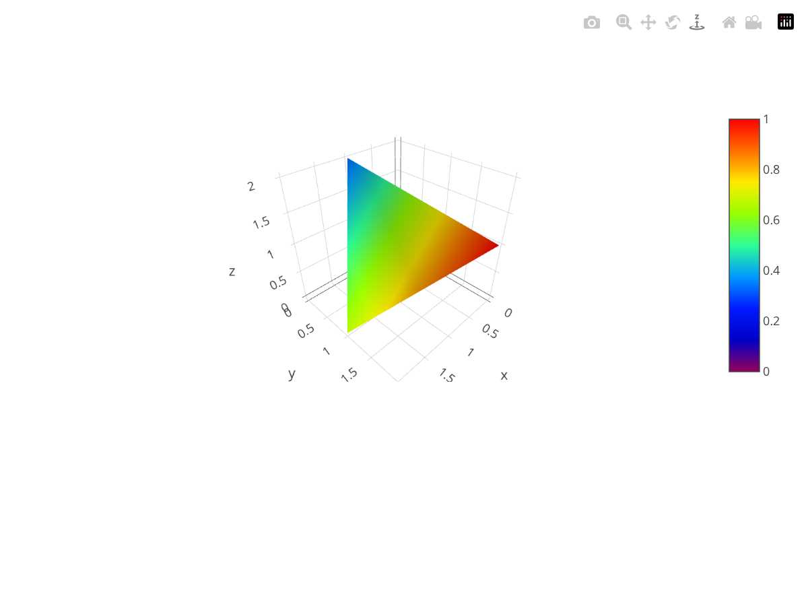

# 3D Charts

The complete source code for the following examples can also be found [here](https://github.com/plotly/plotly.rs/tree/main/examples/3d_charts).

Kind | Link
:---|:----:
Scatter3D |
Surface Plots | 
Mesh3D | 
