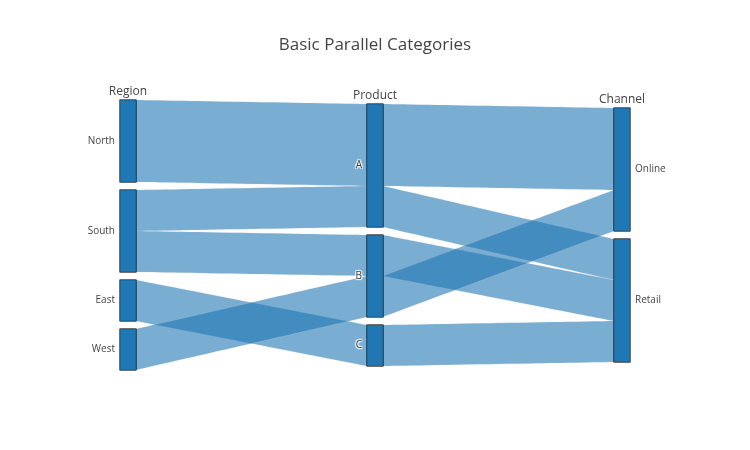
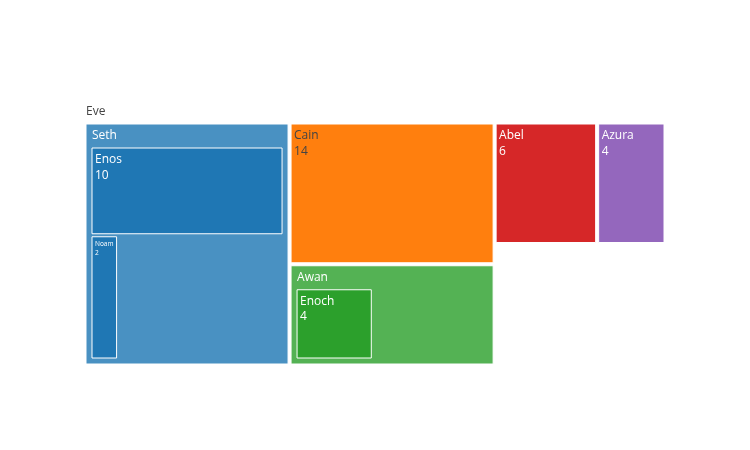
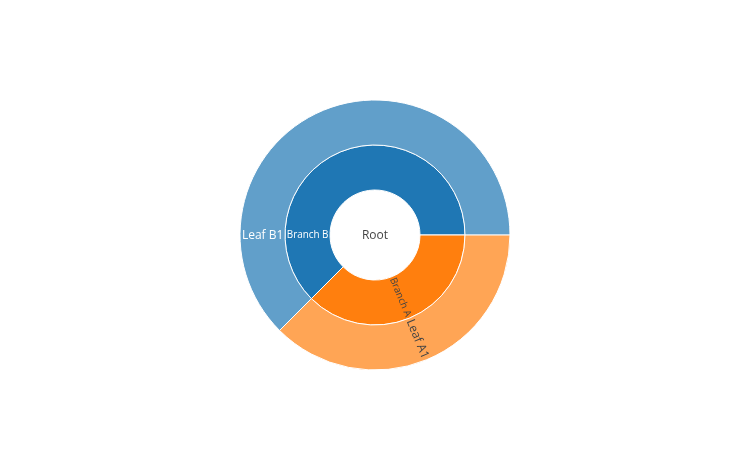
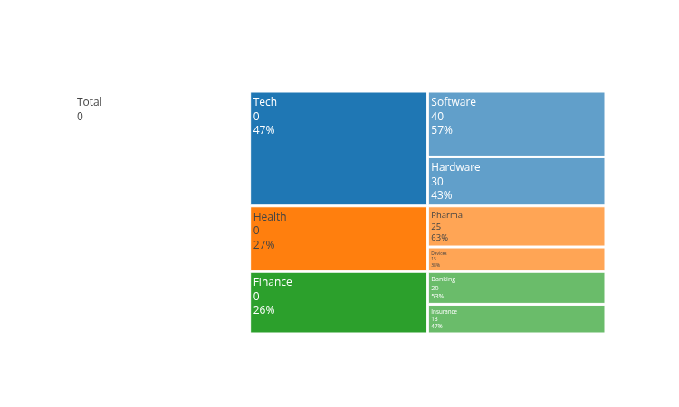
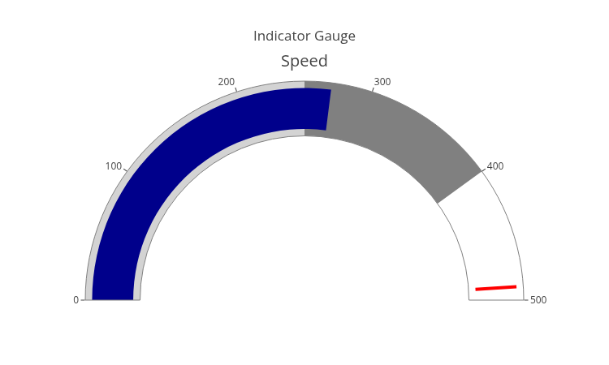
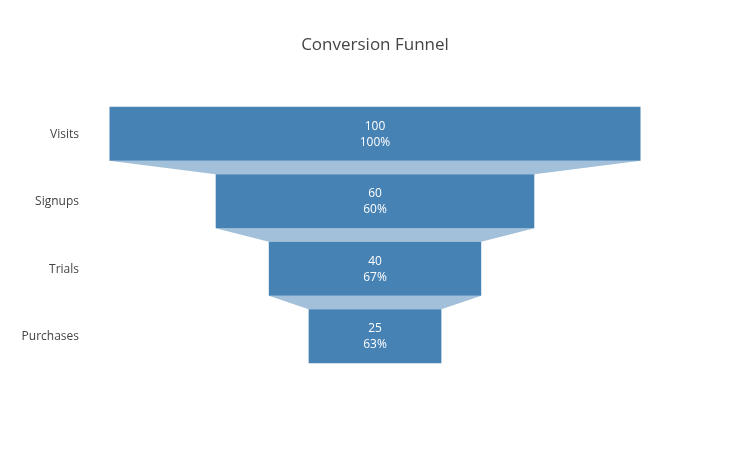
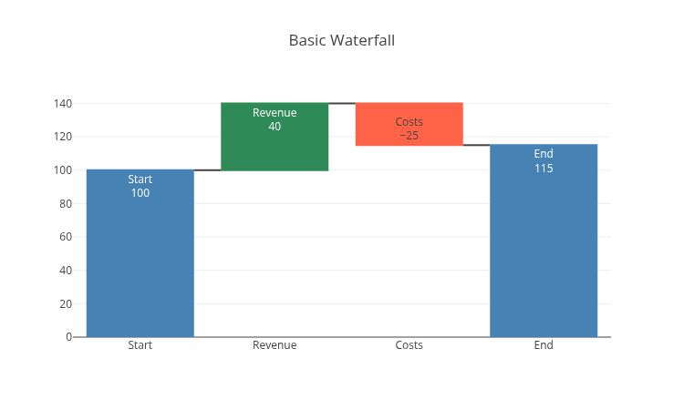

# Basic Charts

The source code for the following examples can also be found [here](https://github.com/plotly/plotly.rs/tree/main/examples/basic_charts).

Kind | Link
:---|:----:
Scatter Plots |
Line Charts | 
Bar Charts | 
Pie Charts | 
Sankey Diagrams | 
Parallel Categories | 
Treemap Charts | 
Sunburst Charts | 
Icicle Charts | 
Indicator Charts | 
Funnel Charts | 
Waterfall Charts | 
