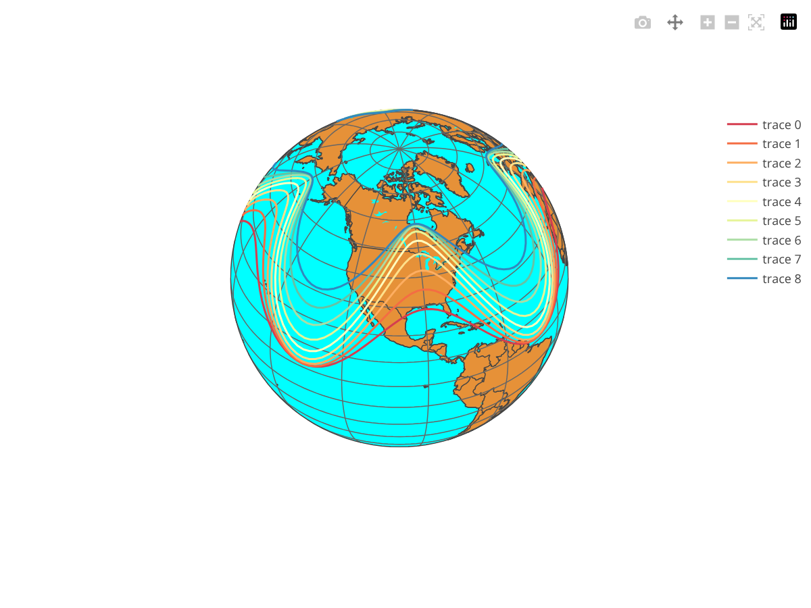
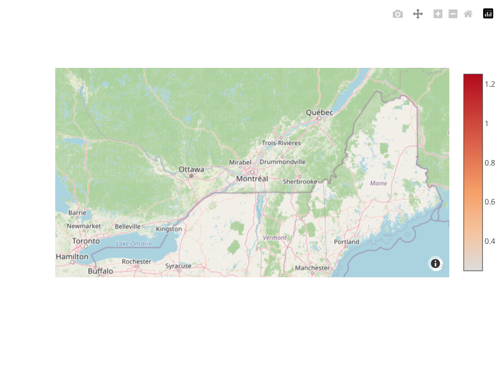
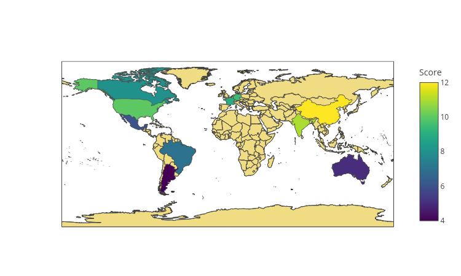

# Maps

The source code for the following examples can also be found [here](https://github.com/plotly/plotly.rs/tree/main/examples/maps).

Kind | Link
:---|:----:
Scatter Maps | 
Density Maps | 
Choropleth Maps | 
